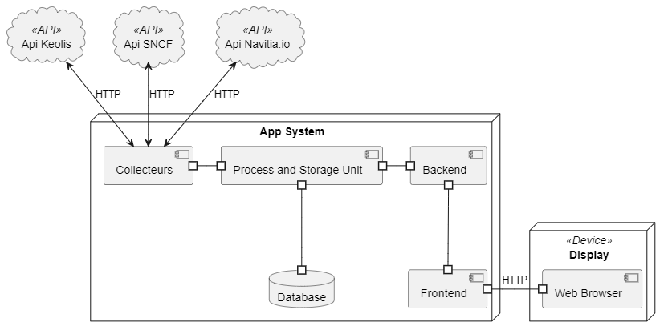

# Intelligo

## Sommaire

- Introduction
- Framework Angular
- Framework Nest.js
- Java
- Python
- MongoDB
- API Star
- API SCNF
- API navita
- Collecteur  
- Unité central de controle et de stockage
- Back-end
- Front-end 

## Introduction

Dans ce guide, nous allons présenter quelques-uns des frameworks et outils les plus populaires pour le développement de notre application web. Nous allons aborder les avantages et les caractéristiques de chacun d'entre eux, ainsi que des exemples d'utilisation courante.
Voici notre architecture (A noter que c'est une vision temporaire et que cette architecture peut évoluer au fil du projet) :

## Framework Angular
[Angular](https://angular.io/) est un framework open-source pour le développement d'applications web côté client développé par Google. Il permet de créer des applications riches en fonctionnalités en utilisant un modèle de composants et une logique de programmation basée sur les types de données. Il est particulièrement populaire pour les applications de grande envergure et les applications à haute performance.

## Framework Nest.js
[Nest.js](https://nestjs.com/) est un framework open-source pour le développement d'applications web côté serveur basé sur Node.js. Il permet de créer des applications web évolutives en utilisant les concepts de programmation orientée objet. Il est souvent utilisé pour les applications qui nécessitent des performances élevées.

## Java

[Java](https://www.java.com/) est un langage de programmation open-source populaire utilisé pour développer des applications web, mobiles et d'entreprise. Il est populaire pour sa portabilité et sa sécurité et il est utilisé pour créer des applications en utilisant des frameworks tels que Spring et Play.

## Python

[Python](https://www.python.org/) est un langage de programmation open-source populaire utilisé pour le développement d'applications web, de scripts et d'applications d'apprentissage automatique. Il est utilisé pour créer des applications en utilisant des frameworks tels que Django et Flask. Il est considéré comme un des langages les plus simples pour la compréhension et l'apprentissage, il est aussi très utilisé pour les applications scientifiques et les datas sciences. Il est souvent utilisé pour les tâches d'automatisation, scraping de données et analyse de données. Il possède aussi un grand nombre de librairies pour ces usages.

## MongoDB

[MongoDB](https://www.mongodb.com/) est une base de données NoSQL populaire utilisée pour stocker les données des applications. Il permet de stocker des données de différentes structures de manière efficace, Il est souvent utilisé en combinaison avec les frameworks web pour créer des applications web évolutives et riches en fonctionnalités. Il permet aussi de gérer les données à grande échelle.

## API Star 

[API STAR](https://data.explore.star.fr/api/v2/console) - Cette API permet de récupérer les horaires des bus qui sont actuellement en service sur le réseau.

## API SCNF
[API SCNF](https://numerique.sncf.com/startup/api/) - Cette API permet de récupérer les horaires des trains qui sont actuellement en service sur le réseau.
## API Navita
[Navitia](https://navitia.io) - Cette API permet de récupérer une liste de chemins entre un point A et un point B. Ces chemins récupérés sont des chemins optimaux.

## Collecteur

Le collecteur est un module qui permet de collecter des données à partir de différentes sources qui seront dans notre application les API vu plus haut. Il permet de gérer la quantité pour les pré-traiter. Les données collectées sont ensuite utilisées pour alimenter d'autres parties de l'application ou du système.
Il sera réalisé en Python.

## Unité centrale de contrôle et de stockage

L'unité central de contrôle et de stockage est un module qui est responsable de la gestion des données de l'application. Celui-ci aura comme tâche de traiter les données que le collecteur lui enverra et de les stocker dans une base de données ensuite. De même le backend pourra communiquer avec lui pour lui demander des donnés pour les affichés à l'utilisateur. Le traitement des données se fera sous JAVA et la base de donnée sera une base MongoDB.

## Back-end

Le back-end est la partie d'une application ou d'un système qui gère les tâches cachées aux utilisateurs, telles que la gestion des données, la communication avec les bases de données et les autres modules de notre application. C'est généralement la partie du système qui est invisible pour les utilisateurs finaux.
Elle sera réalisé avec l'aide du framework NestJS.

## Front-end

Le front-end est la partie d'une application ou d'un système qui est visible pour les utilisateurs finaux. Il s'agit de l'interface utilisateur de notre application. Il utilisera le framework Angular.
