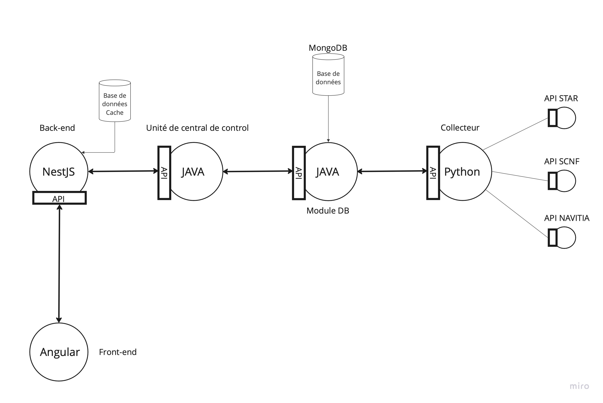

# Intelligo

## Sommaire

- Introduction
- Framework Angular
- Framework Nest.js
- Java
- Python
- MongoDB
- API Star
- API SCNF
- API navita
- Collecteur 
- Module DB
- Unité central de controle
- Back-end
- Front-end 

## Introduction

Dans ce guide, nous allons présenter quelques-uns des frameworks et outils les plus populaires pour le développement de notre application web. Nous allons aborder les avantages et les caractéristiques de chacun d'entre eux, ainsi que des exemples d'utilisation courante.
Voici notre architecture :

## Framework Angular
[Angular](https://angular.io/) est un framework open-source pour le développement d'applications web côté client développé par Google. Il permet de créer des applications riches en fonctionnalités en utilisant un modèle de composants et une logique de programmation basée sur les types de données. Il est particulièrement populaire pour les applications de grande envergure et les applications à haute performance.

## Framework Nest.js
[Nest.js](https://nestjs.com/) est un framework open-source pour le développement d'applications web côté serveur basé sur Node.js. Il permet de créer des applications web évolutives en utilisant les concepts de programmation orientée objet. Il est souvent utilisé pour les applications qui nécessitent des performances élevées et une scalabilité facile.

## Java

[Java](https://www.java.com/) est un langage de programmation open-source populaire utilisé pour développer des applications web, mobiles et d'entreprise. Il est populaire pour sa portabilité et sa sécurité et Il est utilisé pour créer des applications en utilisant des frameworks tels que Spring et Play.

## Python

[Python](https://www.python.org/) est un langage de programmation open-source populaire utilisé pour le développement d'applications web, de scripts et d'applications d'apprentissage automatique. Il est utilisé pour créer des applications en utilisant des frameworks tels que Django et Flask. Il est considéré comme un des langages les plus simples pour la compréhension et l'apprentissage, il est aussi très utilisé pour les applications scientifiques et les data science. Il est souvent utilisé pour les tâches de automatisation, scraping de données et analyse de données. Il possède aussi un grand nombre de librairies pour ces usages.

## MongoDB

[MongoDB](https://www.mongodb.com/) est une base de données NoSQL populaire utilisée pour stocker les données des applications. Il permet de stocker des données de différentes structures de manière efficace, Il est souvent utilisé en combinaison avec les frameworks web pour créer des applications web évolutives et riches en fonctionnalités. Il permet aussi de gérer les données à grande échelle.

